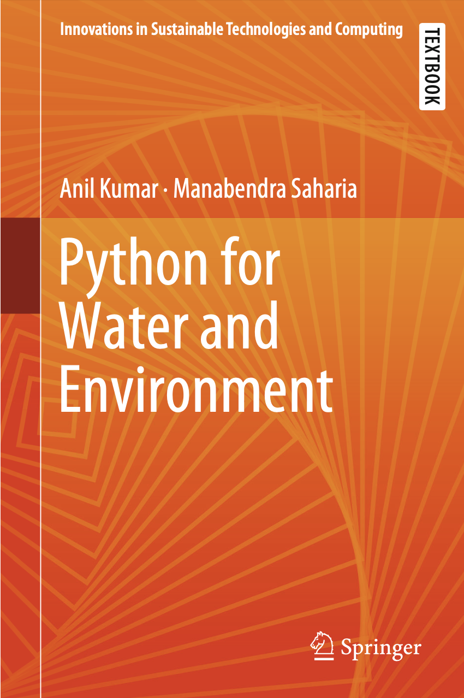

# Python for Water and Environment - Code Repository

This repository contains Python codes accompanying the book _Python for Water and Environment_ by Dr. Anil Kumar and Dr. Manabendra Saharia. These codes provide practical implementations for water resources and environmental modeling, from data analysis to numerical simulations. The repository is ideal for both beginners and experts aiming to apply Python techniques to hydrologic and environmental challenges.

For more resources, visit please the [HydroSense (IIT Delhi)](http://hydrosense.iitd.ac.in) Lab.
